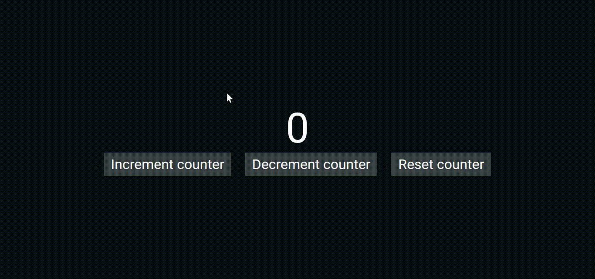

[](/license.txt)

## Table of contents
- [How to use](#how-to-use)
- [Demo](#demo)
- [Technologies](#technologies)
- [Functionality](#functionality)
- [Support](#support)
- [License](#license)

# Counter-app [🔝](#table-of-contents)

A simple and accessible counter component made with HTML, CSS and pure JavaScript.

## Functionality

- Increment, decrement and reset the counter value
- Audio feedback when clicking and hovering (with random sounds)
- Keyboard support:
    - Tab, Shift + Tab, ArrowRight and ArrowLeft to navigate between the buttons
- Manual focus trap to prevent focus from escaping the button group
- Visual feedback with animation when counter value changes
- ARIA attributes for improved accessibility 

## Demo
[]()

## How to use

Clicking the **increment counter** button will sum the counter value to 1, **decrement counter** will subtract the counter value to 1 and **reset counter** will reset the counter to 0.

## How to locally run the project

1. Clone the repository.
```bash
git clone https://github.com/irmaodoguilherme/counter-app.git
```

2. Navigate to the project's folder.
```bash
cd counter-app
```

3. Run it locally using LiveServer in VSCode.

> Alternative: Double click the `index.html` file.

## Technologies

- JavaScript
- HTML
- CSS

## Support [🔝](#table-of-contents)
You can contact me through [contatoguilherme83@gmail.com](mailto:contatoguilherme83@gmail.com).

I accept any recommendations regarding the application. I'd be happy to add a little piece of every new idea so another person could study it.

Any found bugs can and should be reported through the `issues` section.

## License [🔝](#table-of-contents)

This project is licensed under the [MIT License](/license.txt)